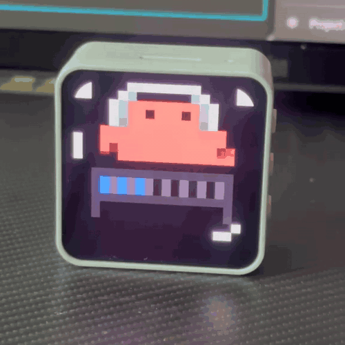
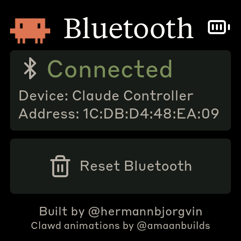

# Claude Usage Tracker - Waveshare ESP32-S3-Touch-AMOLED-2.16

Bluetooth-connected Claude Code usage monitor and touch controller on a
[Waveshare ESP32-S3-Touch-AMOLED-2.16](https://docs.waveshare.com/ESP32-S3-Touch-AMOLED-2.16)
2.16" square AMOLED touchscreen with battery, IMU-driven auto-rotation, and a
splash screen of pixel-art creatures.



## Features

- **Splash screen** — 13 looping 20×20 pixel-art creature animations scaled 24× to fill the display. Default boot screen.
- **Usage dashboard** — Live 5-hour session and 7-day weekly utilization bars with color-coded thresholds
- **Physical button shortcuts** — Left button → Space (voice mode), right button → Shift+Tab (mode toggle); both sent over BLE HID
- **Bluetooth screen** — Connection status, device name, MAC address, bond management
- **Auto-rotation** — QMI8658 accelerometer drives 90° rotation snaps with a quick AMOLED brightness flash transition
- **Battery indicator** — Lucide battery icons in the upper-right corner, AXP2101-driven
- **Wireless** — All data communication over Bluetooth Low Energy (USB only for flashing and charging)

## Hardware

- [Waveshare ESP32-S3-Touch-AMOLED-2.16](https://docs.waveshare.com/ESP32-S3-Touch-AMOLED-2.16) — ESP32-S3R8, 2.16" 480×480 AMOLED (CO5300 QSPI), CST9220 cap touch, AXP2101 PMU + Li-Po battery, QMI8658 IMU
- USB-C cable for flashing firmware and charging
- 3.7V Li-Po battery (MX1.25 2-pin connector, optional)

## Prerequisites

- Linux (tested on Ubuntu)
- [PlatformIO CLI](https://docs.platformio.org/en/latest/core/installation/index.html)
- `curl`, `bluetoothctl`, `busctl` (BlueZ Bluetooth stack)
- Claude Code with an active subscription

## Flash the firmware

```bash
cd firmware
pio run -t upload --upload-port /dev/ttyACM0
```

## Bluetooth pairing

After flashing, the device advertises as **"Claude Controller"**. Pair it once:

```bash
# Scan for the device
bluetoothctl scan le

# When "Claude Controller" appears, pair and trust it
bluetoothctl pair F4:12:FA:C0:8F:E5    # use your device's MAC
bluetoothctl trust F4:12:FA:C0:8F:E5
```

The MAC address is shown on the Bluetooth screen (third screen, tap the logo to cycle).

## Install the daemon

The daemon polls your Claude usage every 30 seconds and sends it to the display over BLE.

```bash
./install.sh
systemctl --user start claude-usage-daemon
```

Check status: `systemctl --user status claude-usage-daemon`

View logs: `journalctl --user -u claude-usage-daemon -f`

## How it works

1. The daemon reads your Claude Code OAuth token from `~/.claude/.credentials.json`
2. Makes a minimal API call to `api.anthropic.com/v1/messages` (1 token of Haiku, essentially free)
3. Extracts usage data from the response headers (`anthropic-ratelimit-unified-5h-utilization`, etc.)
4. Connects to the ESP32 over BLE and writes a JSON payload to the GATT RX characteristic
5. The ESP32 parses it and updates the LVGL dashboard
6. The left/right physical buttons send Space and Shift+Tab as BLE HID keyboard input to the paired host (no host-side daemon involvement)

## Screens

Two persistent screens, **Usage** and **Bluetooth**, are cycled by the **middle physical button (PWR)**. The **splash** is a touch-toggled welcome animation: tap anywhere on the display (outside the Reset zone on the Bluetooth screen) to show it; tap again to dismiss.

|              Usage              |                Bluetooth                |               Splash                |
| :-----------------------------: | :-------------------------------------: | :---------------------------------: |
|  |  | Looping 20×20 pixel-art creatures   |
| Session and weekly utilization  |       Connection status and reset       | Boot screen; touch-toggle anytime   |

The splash screen is also the default boot screen.

## Physical buttons

The board has three physical buttons in a row. Functions are global (screen-independent) for the left and right buttons; the middle button is screen-aware.

| Button              | GPIO         | Function                                                                      |
| ------------------- | ------------ | ----------------------------------------------------------------------------- |
| **Left**            | GPIO 0       | Hold to send Space (Claude Code voice-mode push-to-talk)                      |
| **Middle** (PWR)    | AXP2101 PKEY | Cycle screens (Usage ↔ Bluetooth); on splash, cycle animations                |
| **Right**           | GPIO 18      | Press to send Shift+Tab (Claude Code mode toggle)                             |

Space and Shift+Tab are delivered as standard BLE HID keyboard reports — they work in any focused window on the paired host, not just Claude Code.

## BLE protocol

The device advertises a custom GATT service alongside the standard HID keyboard service:

|                            | UUID                                   |
| -------------------------- | -------------------------------------- |
| **Data Service**           | `4c41555a-4465-7669-6365-000000000001` |
| RX Characteristic (write)  | `4c41555a-4465-7669-6365-000000000002` |
| TX Characteristic (notify) | `4c41555a-4465-7669-6365-000000000003` |
| **HID Service**            | `00001812-0000-1000-8000-00805f9b34fb` |

JSON payload format (written to RX):

```json
{ "s": 45, "sr": 120, "w": 28, "wr": 7200, "st": "allowed", "ok": true }
```

Fields: `s` = session %, `sr` = session reset (minutes), `w` = weekly %, `wr` = weekly reset (minutes), `st` = status, `ok` = success flag.

## Recompiling fonts

The `firmware/src/font_*.c` files are pre-compiled LVGL bitmap fonts. Sizes are
scaled for the 314 PPI 2.16" display (~1.9× the original 165 PPI 3.5" panel).

```bash
npm install -g lv_font_conv
```

Generate each one (one at a time — `lv_font_conv` doesn't like loop-driven invocations) with `--no-compress` (required for LVGL 9):

```bash
# Tiempos Text (titles, 56px)
lv_font_conv --font assets/TiemposText-400-Regular.otf -r 0x20-0x7E \
  --size 56 --format lvgl --bpp 4 --no-compress \
  -o firmware/src/font_tiempos_56.c --lv-include "lvgl.h"

# Styrene B (large numbers 48, panel labels 28, small text 24, minimal 20)
for size in 48 28 24 20; do
  lv_font_conv --font assets/StyreneB-Regular.otf -r 0x20-0x7E \
    --size $size --format lvgl --bpp 4 --no-compress \
    -o firmware/src/font_styrene_${size}.c --lv-include "lvgl.h"
done

# DejaVu Sans Mono (32px, with spinner Unicode chars)
lv_font_conv --font assets/DejaVuSansMono.ttf \
  -r 0x20-0x7E,0xB7,0x2026,0x2722,0x2733,0x2736,0x273B,0x273D \
  --size 32 --format lvgl --bpp 4 --no-compress \
  -o firmware/src/font_mono_32.c --lv-include "lvgl.h"
```

**Important:** `lv_font_conv` v1.5.3 outputs LVGL 8 format. Each generated file must be patched for LVGL 9 compatibility:

1. Remove `#if LVGL_VERSION_MAJOR >= 8` guards around `font_dsc` and the font struct
2. Remove the `.cache` field from `font_dsc`
3. Add `.release_glyph = NULL`, `.kerning = 0`, `.static_bitmap = 0` to the font struct
4. Add `.fallback = NULL`, `.user_data = NULL` to the font struct

Without these patches, fonts compile but render as invisible.

## Converting Lucide icons

The controller screen uses [Lucide](https://lucide.dev) icons (the same icon set Anthropic uses). Icons are SVGs converted to RGB565 C arrays for LVGL.

1. Get Lucide SVGs from [github.com/lucide-icons/lucide](https://github.com/lucide-icons/lucide) (`icons/` directory)

2. Convert SVG to PNG at desired size (icons are 48×48 to match the high-DPI display, hand icon is 40×40, logo is 80×80):

```bash
inkscape icons/delete.svg --export-width=48 --export-height=48 \
  --export-filename=assets/icon_delete_48.png --export-background-opacity=0
```

3. Convert PNG to RGB565 C array:

```python
from PIL import Image

img = Image.open("assets/icon_delete.png").convert("RGBA")
bg = (0x1f, 0x1f, 0x1e)  # panel background color
fg = (0xb0, 0xae, 0xa5)  # icon stroke color

pixels = []
for y in range(img.height):
    for x in range(img.width):
        r, g, b, a = img.getpixel((x, y))
        alpha = a / 255.0
        out_r = int(fg[0] * alpha + bg[0] * (1 - alpha))
        out_g = int(fg[1] * alpha + bg[1] * (1 - alpha))
        out_b = int(fg[2] * alpha + bg[2] * (1 - alpha))
        rgb565 = ((out_r >> 3) << 11) | ((out_g >> 2) << 5) | (out_b >> 3)
        pixels.append(rgb565)

# Write as C array to firmware/src/icons.h
```

Current icons: `delete`, `arrow-left`, `arrow-right`, `circle-arrow-out-up-left` (escape), `hand` (gestures), `bluetooth`.

## Splash animations

The splash screen plays 20×20 pixel-art creature animations sourced from
[claudepix.vercel.app](https://claudepix.vercel.app), a public library of
creature animations. Frame data and palettes are extracted by
`tools/scrape_claudepix.js` (which evaluates the source's JavaScript in a Node
VM context to resolve frames) and converted to RGB565 C arrays by
`tools/convert_to_c.js`. The output lives in `firmware/src/splash_animations.h`.

To re-pull (e.g. when the source library updates):

```bash
node tools/scrape_claudepix.js
node tools/convert_to_c.js
pio run -d firmware -t upload
```

See `tools/README.md` for details.

## Credits

- Built by [@hermannbjorgvin](https://github.com/hermannbjorgvin) (Hermann Björgvin Haraldsson).
- Pixel-art "Clawd" creature animations by [@amaanbuilds](https://github.com/amaanbuilds), sourced from [claudepix.vercel.app](https://claudepix.vercel.app). Frame data and palettes scraped + converted by the tooling in `tools/`.
- Lucide icon set ([lucide.dev](https://lucide.dev), MIT) for controller and bluetooth UI glyphs.
- Anthropic brand fonts (Tiempos Text, Styrene B) — see licensing warning below.

## Licensing gray area warning

The software in this repository uses and adheres to the Anthropic brand guidelines and uses the same proprietary fonts that Anthropic has a licnese for but this software uses without permission as well as using assets from Anthropic such as the copyrighted Claude Code mascot head logo so even though the code in this repo is non-proprietary I will not license it myself under a copyleft license since this repo includes proprietary fonts and copyrighted assets. Please be aware of this if you fork or copy the code from this repo. **You have been warned!**
