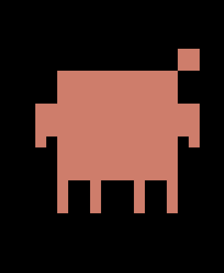

# Clawdmeter — Claude Code + Codex on a low-cost ESP32 display

This repository is a hardware and Windows-focused fork of
[Hermann Bjorgvin's Clawdmeter](https://github.com/HermannBjorgvin/Clawdmeter).
The original project created the ESP32 Claude Code usage dashboard and Clawd
pixel-art experience. This fork adds Codex and combined activity pages, a tested
USB-serial Windows service, and support for the capacitive 2.4-inch
ESP32-2432S024C in portrait and landscape.

This is an independent community fork. It is not endorsed by Anthropic or
OpenAI.

**Documentation:** [Português (Brasil)](docs/README.pt-BR.md) · English (this page)

## Gallery

The Clawd animations react to Claude usage and rotate while the splash is
visible. The assets below come from the original Clawdmeter experience; they are
not photographs of the ESP32-2432S024C port.

| Usage interface | Animated Clawd splash |
| :---: | :---: |
|  |  |

| 2.16-inch AMOLED splash | 1.8-inch AMOLED splash |
| :---: | :---: |
|  |  |

## What this fork adds

The comparison is against the upstream baseline used to build this fork.
Upstream may gain related capabilities independently.

| Area | Original baseline | This fork |
| --- | --- | --- |
| Providers | Claude Code usage | Claude Code plus local Codex usage and activity |
| Dashboard | Usage and splash flow | Claude, Codex, and combined Activity pages |
| Navigation | Original screen behavior | Left/right touch navigation, 12-second automatic cycle, 30-second manual holdoff |
| Windows transport | Primarily BLE-oriented | Tested USB serial service and tray app; Bluetooth is not required for the ESP32-2432S024C |
| Hardware | Waveshare AMOLED boards and upstream ports | Capacitive 2.4-inch ESP32-2432S024C, 240×320, portrait and USB-left landscape |
| Activity | Claude-oriented state | Claude Open/Busy/Waiting plus Codex Unread, semantic colors, and freshness |

## Dashboard pages and navigation

The display has three pages:

- **Claude** — current five-hour session, weekly utilization, and the optional
  Fable scoped weekly allowance, including reset times.
- **Codex** — up to two locally observed rate-limit windows, tokens used today,
  and plan name when available.
- **Activity** — aggregate Claude Code Open, Busy, and Waiting counts together
  with Codex Unread and the local scan freshness.

Tap the **left half** of the screen to go back and the **right half** to go
forward. Navigation wraps in both directions. Without interaction, the pages
advance every 12 seconds. A manual tap pauses automatic cycling for 30 seconds.

If a local provider cannot be read, its metrics show **Unavailable** rather than
a fabricated zero. The boot/pairing splash remains separate from the three-page
dashboard.

## Hardware

### Tested low-cost board: ESP32-2432S024C

The port developed and physically validated in this fork targets the
**Sunton/Jingcai ESP32-2432S024C**:

- 2.4-inch 240×320 color TFT;
- capacitive touch — verify the final model suffix is **C**;
- classic ESP32-WROOM-class module with Wi-Fi and Bluetooth;
- microSD slot and exposed GPIO;
- USB serial for power, firmware upload, and dashboard data;
- portrait and landscape builds; the tested landscape position has USB on the
  left.

References and purchase searches:

- [CircuitPython technical board reference](https://circuitpython.org/board/sunton_esp32_2432S024C/)
- [Exact-model retail example](https://www.amazon.com/dp/B0CLGD2DG6)
- [AliExpress marketplace search](https://www.aliexpress.com/w/wholesale-esp32--2432s024c.html)
- [Waveshare ESP32-S3-Touch-AMOLED-2.16 used by the original project](https://www.waveshare.com/product/esp32-s3-touch-amoled-2.16.htm)

This TFT/classic-ESP32 design is commonly a lower-cost alternative to the
higher-resolution Waveshare AMOLED board. Prices and inventory change, so check
the exact model before ordering. The lower cost also means a 240×320 TFT, less
memory and integration, and no equivalent 480×480 AMOLED panel, audio subsystem,
IMU, or advanced battery management.

Do not confuse the capacitive **ESP32-2432S024C** with similarly named **R**
variants, which use resistive touch.

### Other upstream-supported boards

The inherited HAL also includes these upstream targets:

- [Waveshare ESP32-S3-Touch-AMOLED-2.16](https://www.waveshare.com/esp32-s3-touch-amoled-2.16.htm?&aff_id=149786)
- [Waveshare ESP32-C6-Touch-AMOLED-2.16](https://www.waveshare.com/esp32-c6-touch-amoled-2.16.htm?&aff_id=149786)
- [Waveshare ESP32-S3-Touch-AMOLED-1.8](https://www.waveshare.com/esp32-s3-touch-amoled-1.8.htm?&aff_id=149786)
- [Waveshare ESP32-C6-Touch-AMOLED-1.8](https://www.waveshare.com/esp32-c6-touch-amoled-1.8.htm?&aff_id=149786)
- [Waveshare ESP32-S3-Touch-AMOLED-2.06](https://www.waveshare.com/esp32-s3-touch-amoled-2.06.htm?&aff_id=149786)

See [Adding a board](docs/porting/adding-a-board.md),
[HAL contract](docs/porting/hal-contract.md), and
[capability flags](docs/porting/capability-flags.md) before starting another
hardware port.

## Quick start: Windows + ESP32-2432S024C

This is the fully tested path. It runs on native Windows 10/11; WSL is not
required.

### What the PC needs

- Python 3.11+ from [python.org](https://www.python.org/downloads/);
- Claude Code installed and authenticated with `claude login`;
- Codex installed and used locally if you want Codex metrics;
- this repository on a native Windows path;
- a USB **data** cable;
- PlatformIO only if you need to build or flash firmware.

### Install the tray service

Once the fork is published, clone its verified default branch:

```powershell
git clone https://github.com/Atzingen/Clawdmeter.git
cd Clawdmeter
git switch esp32-2432s024c-codex
powershell -ExecutionPolicy Bypass -File install-windows.ps1
```

The installer creates `.venv`, installs the Windows dependencies, registers a
per-user startup entry, and launches the tray app without a console window.

The same USB cable powers the ESP32 and carries dashboard data. Bluetooth
pairing is not required for this board.

Moving the board to another computer is not enough by itself. Install and run
the tray service on each PC that should provide data. An already flashed board
does not need PlatformIO or another firmware upload.

### Build or flash the firmware

Install [PlatformIO Core](https://docs.platformio.org/en/latest/core/installation/index.html),
then choose the orientation:

```powershell
# Portrait
pio run -d firmware -e esp32_2432s024c -j 1

# Landscape — tested with USB on the left
pio run -d firmware -e esp32_2432s024c_landscape -j 1
```

Upload to the board, replacing `COM3` when needed:

```powershell
# Portrait
pio run -d firmware -e esp32_2432s024c -t upload --upload-port COM3

# Landscape
pio run -d firmware -e esp32_2432s024c_landscape -t upload --upload-port COM3
```

Keep the build environment and its touch transform paired. If the image
orientation is wrong, confirm that you flashed the intended environment before
changing display or touch code.

### Tray status and logs

The tray icon shows its state:

- green: connected;
- amber: scanning;
- red: error.

View the log:

```powershell
Get-Content $env:LOCALAPPDATA\Clawdmeter\daemon.log -Tail 30
```

Set a fixed serial port only when automatic detection is not appropriate:

```powershell
$env:CLAWDMETER_SERIAL_PORT = "COM3"
```

For manual execution and detailed recovery steps, see the
[Windows setup and run guide](daemon/README-windows.md).

### Windows troubleshooting

| Symptom | What to check |
| --- | --- |
| `Clawdmeter USB serial not found` | Use a data-capable cable, reconnect the board, and inspect Device Manager. |
| Wrong COM port | Set `CLAWDMETER_SERIAL_PORT` before starting the tray. |
| Claude API HTTP 401 | Run `claude login` again and restart the tray. |
| Codex shows `Unavailable` | Use Codex locally so `%USERPROFILE%\.codex\sessions` exists; internal schemas may also have changed. |
| Activity has no Claude rows | Confirm local Claude session state exists under `%USERPROFILE%\.claude\sessions`. |
| Mirrored or rotated display | Reflash the correct portrait/landscape environment; landscape expects USB on the left. |
| No updates after moving PCs | Install the tray on the new PC; the firmware does not read Claude/Codex data by itself. |

## How the data flow works

On Windows:

1. The tray reads the existing Claude Code authentication state and polls Claude
   utilization.
2. It reads the optional Fable scoped weekly allowance from Claude Code's OAuth
   usage response.
3. It aggregates only local Claude session statuses from
   `%USERPROFILE%\.claude\sessions`.
4. It aggregates Codex `token_count` and rate-limit events from
   `%USERPROFILE%\.codex\sessions`.
5. It reads Codex Unread from
   `%USERPROFILE%\.codex\.codex-global-state.json`.
6. It sends a compact aggregate payload to the ESP32 over USB serial roughly
   every 60 seconds.
7. The firmware updates the dashboard and acknowledges the write.

Prompt text, responses, task titles, and session contents are not sent to the
display.

Codex local session/state JSON is an internal format, **not a documented public
OpenAI telemetry API**. If the expected schema is absent or changes, Codex
values become `Unavailable` while Claude data can continue working. For Codex
product and installation information, see the official
[OpenAI Codex repository](https://github.com/openai/codex).

The Fable allowance also comes from an internal Claude Code OAuth usage
interface rather than a documented public telemetry API. If its response no
longer contains an active Fable scoped limit, the Fable row shows
`Unavailable` without affecting the other metrics.

## macOS installation

The inherited macOS host pieces were ported by
[Chris Davidson (@lorddavidson)](https://github.com/lorddavidson).

Flash a supported board:

```bash
./flash-mac.sh waveshare_amoled_216
./flash-mac.sh waveshare_amoled_18 /dev/cu.usbmodem1101
```

Install the daemon:

```bash
./install-mac.sh
```

The installer creates a Python environment, installs the BLE dependencies, and
loads a LaunchAgent. Pair the device in macOS Bluetooth settings first when
using a BLE-based board.

Useful commands:

```bash
launchctl list | grep claude-usage
tail -F ~/Library/Logs/claude-usage-daemon.out.log
launchctl unload ~/Library/LaunchAgents/com.user.claude-usage-daemon.plist
launchctl load -w ~/Library/LaunchAgents/com.user.claude-usage-daemon.plist
```

## Linux installation

Flash a supported board:

```bash
./flash.sh waveshare_amoled_216
./flash.sh waveshare_amoled_18 /dev/ttyACM1
```

Pair and trust a BLE-based Clawdmeter once:

```bash
bluetoothctl scan le
bluetoothctl pair F4:12:FA:C0:8F:E5
bluetoothctl trust F4:12:FA:C0:8F:E5
```

Install and start the daemon:

```bash
./install.sh
systemctl --user start claude-usage-daemon
systemctl --user status claude-usage-daemon
```

Follow logs with:

```bash
journalctl --user -u claude-usage-daemon -f
```

## Bluetooth and physical buttons

Bluetooth is optional for the ESP32-2432S024C dashboard because its data uses
USB serial. On upstream boards that expose BLE HID buttons, the side buttons
send Space and Shift+Tab to the paired host and the power button can control
splash/pairing behavior.

The ESP32-2432S024C port does not claim the Waveshare button layout. Its BOOT
button is used for local display controls.

The inherited custom data service uses these UUIDs on BLE-capable targets:

| Service | UUID |
| --- | --- |
| Data Service | `4c41555a-4465-7669-6365-000000000001` |
| RX Characteristic | `4c41555a-4465-7669-6365-000000000002` |
| TX Characteristic | `4c41555a-4465-7669-6365-000000000003` |
| HID Service | `00001812-0000-1000-8000-00805f9b34fb` |

## Development and porting

The firmware uses a thin board HAL under `firmware/src/boards/`. A board port
normally adds a board folder and PlatformIO environment while keeping shared UI
logic board-independent.

### Recompiling fonts

The `firmware/src/font_*.c` files are precompiled LVGL bitmap fonts. Install
`lv_font_conv`:

```bash
npm install -g lv_font_conv
```

The project uses Tiempos Text, Styrene B, and DejaVu Sans Mono assets under
`assets/`. Generate with `--no-compress`, then apply the LVGL 9 compatibility
changes documented in the existing generated files: remove LVGL 8 guards and
`.cache`, then provide the LVGL 9 descriptor fields.

### Converting icons and logos

```bash
node tools/png_to_lvgl.js assets/icon_bluetooth_48.png icon_bluetooth_data ICON_BLUETOOTH_WIDTH ICON_BLUETOOTH_HEIGHT
```

The converter tints black Lucide sources white by default. Use `--no-tint` for
pre-colored artwork. The Codex page uses a monochrome OpenAI Blossom asset in
accordance with the [OpenAI brand guidelines](https://openai.com/brand/).

### Splash animations

The animations come from [claudepix.vercel.app](https://claudepix.vercel.app),
a library of Clawd sprites by
[@amaanbuilds](https://x.com/amaanbuilds). To refresh and rebuild the generated
arrays:

```bash
node tools/scrape_claudepix.js
node tools/convert_to_c.js
```

See [tools/README.md](tools/README.md) for the conversion details.

## Credits

- [Hermann Bjorgvin](https://github.com/HermannBjorgvin) and contributors for
  the original [Clawdmeter](https://github.com/HermannBjorgvin/Clawdmeter).
- [@amaanbuilds](https://x.com/amaanbuilds) for the pixel-art Clawd animation
  library at [claudepix.vercel.app](https://claudepix.vercel.app).
- [Lucide](https://lucide.dev) for the MIT-licensed UI glyphs.
- OpenAI for the Codex product and monochrome Blossom mark; see the
  [OpenAI brand guidelines](https://openai.com/brand/).
- Anthropic brand fonts and Clawd assets remain subject to their respective
  owners' rights.

## Licensing gray-area warning

This repository inherits proprietary fonts and copyrighted mascot/brand assets
from the original project. The original author deliberately did not apply a
copyleft license to the repository because those assets are not owned by the
project. This fork preserves that warning and does not add a license that claims
rights over inherited fonts, the Clawd mascot, or third-party brand marks.

Review the original project's warning and the relevant brand guidelines before
redistributing binaries, assets, or derivative commercial products.
