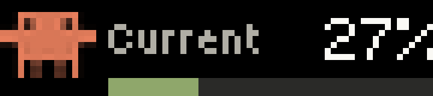

# Petmeter on a BUSY Bar

Coding-agent usage on a [BUSY Bar](https://busy.app) — a 72×16 RGB LED matrix — rotating through every quota your plans meter, each with its label and its mascot.



This is a self-contained corner of [Petmeter](../README.md). The desk meter it belongs to is an ESP32 device; nothing here needs one. All it needs is the Petmeter daemon running on a host the bar can reach.

## Two ways in

|  | Push | Pull |
|---|---|---|
| **What** | the daemon draws on the bar every poll | an app on the bar fetches and draws |
| **Where** | [`daemon/sinks/busybar.py`](../daemon/sinks/busybar.py) | [`petmeter/`](petmeter) — a TypeScript app built with `busy-cli` |
| **Shows** | one quota | every quota, rotating, with mascots |
| **Needs** | a config line | installing the app and launching it |
| **Works today** | yes | yes, but it cannot be launched from the apps menu — see below |

They are complementary: push keeps the bar current while you are not looking; pull makes it right the moment you select it.

### Push

```ini
# ~/.config/claude-usage-monitor/config
busybar_url = http://10.0.4.20      # USB; or http://busybar.local over Wi-Fi
```

Restart the daemon. Dry-run without it:

```bash
python -m daemon.sinks.busybar http://10.0.4.20
```

### Pull

```ini
# ~/.config/claude-usage-monitor/config
busybar_serve = 10.0.4.21:8724      # this host, on the bar's USB network
```

```bash
cd busybar/petmeter && pnpm install && pnpm build
python3 ../../tools/busybar_install_app.py http://10.0.4.20
```

Then launch it over the bar's CLI (`telnet 10.0.4.20`, port 23):

```
js -i app.petmeter /ext/user_assets/app.petmeter/scripts/main.js
```

**Controls**, following what the case itself is engraved with: the red **Start/Pause** bar holds and releases the rotation, the wheel **scrolls** through the cards by hand, and the wheel's press — labelled **OK/Skip** — skips forward.

## What we learned the hard way

Everything here was found against real hardware, and none of it is in the published API spec.

**The device and the cloud mount the same API at different prefixes.** `api.busy.app` documents `/busybar/...`; that is the cloud relay. The bar serves **`/api/...`**. Posting to the documented path reaches the bar's web-UI file server, which answers `405 Allow: GET` — an error that reads like "wrong method" and means "wrong prefix".

**Access over Wi-Fi is off by default; over USB it is not gated.** Ask the device rather than inferring: `GET /api/access` is ungated and returns `{"mode": "disabled"|"enabled"|"key"}`. Over USB the bar is always **10.0.4.20** (printed on its back cover) and the host is **10.0.4.21**.

**An out-of-memory abort is completely silent.** This one cost the most. The JS runtime's heap is small — 40,000 array pushes kills it — and when it dies, nothing is logged: the script's first line prints, the last never does, no error, no exit message. `@busy-app/busy-lib`'s `render()` ships font metric tables that exceed it, so the app composes its elements by hand with absolute coordinates. A 72×16 screen wants absolute positions anyway.

**Image paths resolve against the app root**, not the assets folder — `appmeta/assets/clawd_16.png`, not `clawd_16.png`. And one unreadable image **rejects the entire draw** with a 400, so a wrong path means no frame at all rather than a frame with a gap in it.

**`rectangle` has no `color`.** It has a `fill` (default `none`) and a border (default 1px, **white**). Pass a colour and nothing else and you get a white outline.

**Storage writes are create-only.** Writing over an existing file returns `508 "Failed to open file for writing"`, which reads like a disk fault and means "this path is taken". Delete first. A running app also holds its script open, so stop it before reinstalling — the installer does both.

**Panel greys vanish.** There is no lit background for them to sit against, so the track colour that reads as "secondary" on an AMOLED reads as "off" here.

**`GET /api/screen` is not the `image/bmp` it advertises.** The front panel returns **base64 text** decoding to 3456 bytes (72×16×3) in **BGR**; the back returns 6400 bytes of 8-bit greyscale at 80×80 for a 160×80 panel, so it is half width. [`tools/busybar_shot.py`](../tools/busybar_shot.py) handles both — QA the layout by looking at it, the way the firmware is QA'd.

**The bar is slow over Wi-Fi and goes quiet.** A draw answers in ~5.0s, consistently, and after a burst of requests it stops answering for ~20s. Over USB the same draw returns in under 0.1s. A timeout set at the measured response time is a coin flip, not a margin.

## Why it is not in the apps menu

It installs, and the menu will not list it. That menu is a hardcoded C array in the open-source firmware — [`applications/system/apps_menu/app_list.c`](https://github.com/busy-app/busybar-firmware/blob/dev/applications/system/apps_menu/app_list.c) — with exactly two entries: `Clock`, and a literal `"Coming soon..."`. Nothing scans `user_assets/`, so no arrangement of files can add a third, and the vendor's own `app.busy.js_example` is not listed either.

The rest of the path exists: `@busy-app/cli` builds a device package, and a `js_app_installer` service stages and installs a `.tgz`. The menu is the unfinished seam. Until it ships, the CLI launch above is how the app runs.

## Layout

```
0        16 18                                  72
├─ mascot ─┤├─ label ······················ pct ─┤
            ├─ bar track, fill = proportion ─────┤
```

16×16 mascot (Clawd for Claude cards, Codey for Codex), 54px for the reading. Colour thresholds are the firmware's `pct_color()` — green under 75%, amber to 90%, red above — because two displays showing one number must not disagree about whether it is alarming.

Reset credits are a count, not a proportion, so that card shows `held/total` and a countdown instead of a bar.
