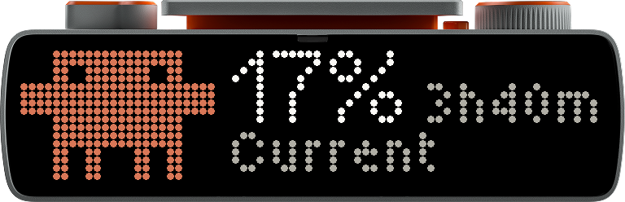
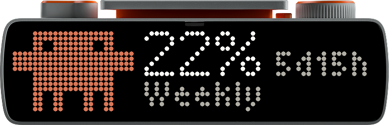
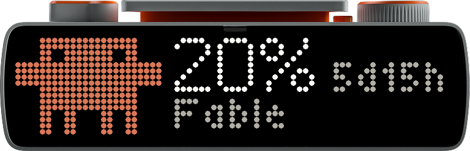
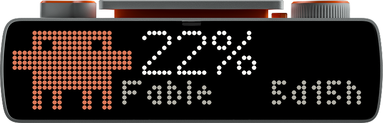
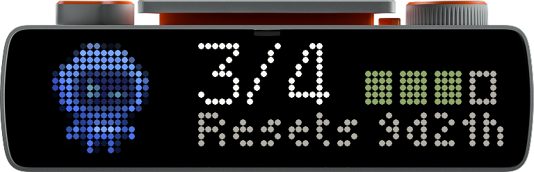
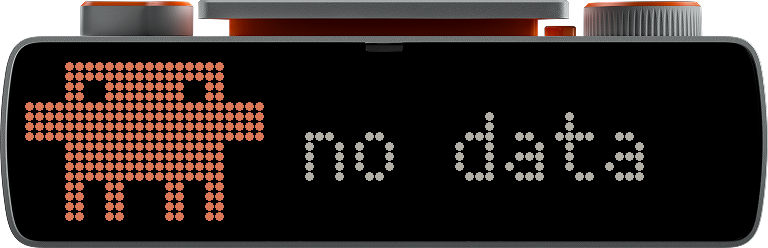
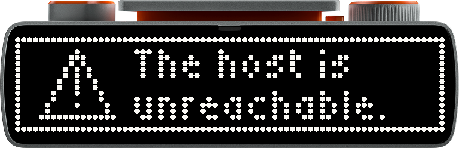
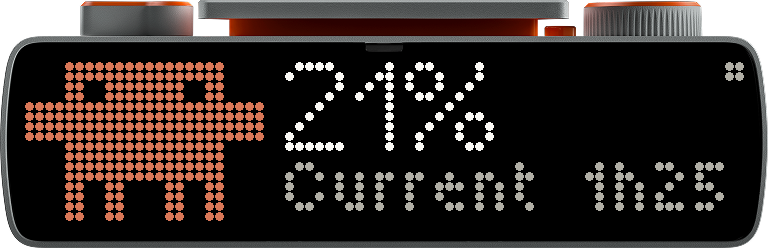
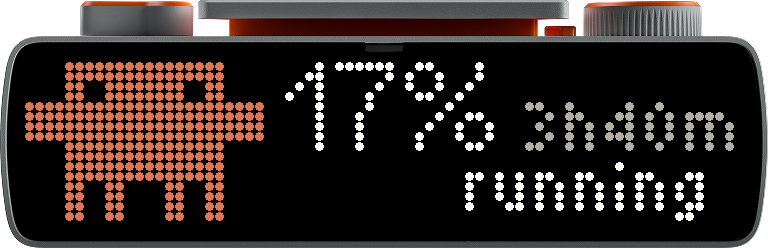

# Petmeter on a BUSY Bar

Coding-agent usage on a [BUSY Bar](https://busy.app) — a 72×16 RGB LED matrix — rotating through every quota your plans meter, each with its label and its mascot.



Every screenshot here is the real device: captured with
[`tools/busybar_shot.py --skin`](../tools/busybar_shot.py), which reads the
panel over the HTTP API and renders it as LEDs inside the hardware, the same
way the bar's own web interface does.

## Every screen

The cards rotate every four seconds, each carrying its provider's mascot.

| | |
|---|---|
|  | **Current** — the 5-hour window |
|  | **Weekly** — the 7-day window |
|  | **Fable** — a scoped model allowance, when the plan meters one |
|  | **Codex**, with Codey — the same reading for the other provider |
|  | **Resets** — the credit ledger: held solid, spent hollow |

And the states you hope not to see:

| | |
|---|---|
|  | **no data** — the daemon is there, the reading is not. The pet stays: the app is alive |
|  | **no host** — the daemon is unreachable. No pet, because the pet lives on the host |
|  | **paused** — the 2×2 badge at the top right, the only room there was for one |
|  | the **toast** on a press — the word replaces the caption for two seconds, then the device removes it itself |

This is a self-contained corner of [Petmeter](../README.md). The desk meter it belongs to is an ESP32 device; nothing here needs one. All it needs is the Petmeter daemon running on a host the bar can reach.

## Two ways in

|  | Push | Pull |
|---|---|---|
| **What** | the daemon draws on the bar every poll | an app on the bar fetches and draws |
| **Where** | [`daemon/sinks/busybar.py`](../daemon/sinks/busybar.py) | [`petmeter/`](petmeter) — a TypeScript app built with `busy-cli` |
| **Shows** | one quota | every quota, rotating, with mascots |
| **Needs** | a config line | installing the app and launching it |
| **Works today** | yes | yes — launch it from the apps menu, or the CLI |

They are complementary: push keeps the bar current while you are not looking; pull makes it right the moment you select it.

### Push

```ini
# ~/.config/claude-usage-monitor/config
busybar_url = http://10.0.4.20      # USB; or http://busybar.local over Wi-Fi
```

Restart the daemon. Dry-run without it:

```bash
python -m daemon.sinks.busybar http://10.0.4.20
```

### Pull

```ini
# ~/.config/claude-usage-monitor/config
busybar_serve = 10.0.4.21:8724      # this host, on the bar's USB network
```

```bash
cd busybar/petmeter && pnpm install && pnpm build
python3 ../../tools/busybar_install_app.py http://10.0.4.20
```

Then launch it over the bar's CLI (`telnet 10.0.4.20`, port 23):

```
js -i app.petmeter /ext/user_assets/app.petmeter/scripts/main.js
```

**Controls are written but cannot run yet.** They follow what the case is engraved with — the red **Start/Pause** bar holds and releases the rotation, the wheel **scrolls** by hand, and its press, labelled **OK/Skip**, skips forward — but a CLI-launched script gets no input API. Its globals are exactly `console`, `setInterval`, `setTimeout`, `clearInterval`, `clearTimeout`, `Request`, `fetch` and `localStorage`; `listen` is installed only for an app launched as an app, which is the same thing [the apps menu blocks](#why-it-is-not-in-the-apps-menu). The binding is guarded and logs that it is disabled, so the display keeps working.

## Nothing here is hosted

Both halves run on hardware you own: the daemon on your machine, the app on the
bar, talking over the USB link (`10.0.4.21` ↔ `10.0.4.20`). The pull endpoint
binds to that interface alone, not `0.0.0.0`.

There is one case where a server would help — reading your usage while away
from the machine — and it is the case to avoid. The numbers come from OAuth
tokens that Claude Code and the Codex CLI keep locally, and this project's rule
is that it only ever reads tokens it does not own. Relaying them through a
hosted service would mean shipping someone else's credentials off the laptop.

Distribution is a GitHub Release, not a deploy: `.github/workflows/release.yml`
turns a version tag into the `.tgz` device package, built by `busy-cli`.

## Should this be its own repo?

Not yet, and the reason is where the seam falls. This is two things, and they
separate differently:

- **The app** (`petmeter/`) is genuinely standalone — its own `package.json`,
  its own release workflow that turns a version tag into a `.tgz` device
  package. It could move tomorrow.
- **The daemon halves** ([`sinks/busybar.py`](../daemon/sinks/busybar.py),
  [`sinks/serve.py`](../daemon/sinks/serve.py),
  [`sinks/busybar_buttons.py`](../daemon/sinks/busybar_buttons.py)) are
  Petmeter. They import the collectors, share the poll loop and the free-ride
  token rule, and exist to turn *Petmeter's* snapshot into cards. Moving them
  means duplicating the collector stack or making Petmeter a package it is
  not.

So splitting today produces a repo that cannot run alone — its README would
have to open with "first install Petmeter", which is the worst outcome for the
audience most likely to find it.

**Split when any of these becomes true:**

1. **The apps menu ships.** Publishing through the BUSY ecosystem becomes
   real, and the app wants its own issues and release cadence.
2. **Someone other than the author runs it.** A second user turns "first
   install Petmeter" from awkward into a support burden.
3. **It outgrows the daemon's orbit** — a second bar-side app, or providers
   Petmeter itself does not carry.

Two arguments already point the other way and are worth re-weighing each time:
a BUSY Bar owner landing in Petmeter finds a repo that is mostly ESP32
firmware — board ports, LVGL fonts, sprite pipelines — which is noise to them;
and Petmeter is a fork that takes upstream merges, so every sync drags across
a tree carrying unrelated Node tooling.

This directory is kept self-contained against that day: the split is a
`git subtree split` and a README edit, not a rewrite.

## What we learned the hard way

Everything here was found against real hardware, and none of it is in the published API spec.

**The device and the cloud mount the same API at different prefixes.** `api.busy.app` documents `/busybar/...`; that is the cloud relay. The bar serves **`/api/...`**. Posting to the documented path reaches the bar's web-UI file server, which answers `405 Allow: GET` — an error that reads like "wrong method" and means "wrong prefix".

**Access over Wi-Fi is off by default; over USB it is not gated.** Ask the device rather than inferring: `GET /api/access` is ungated and returns `{"mode": "disabled"|"enabled"|"key"}`. Over USB the bar is always **10.0.4.20** (printed on its back cover) and the host is **10.0.4.21**.

**An out-of-memory abort is completely silent.** This one cost the most. The JS runtime's heap is small — 40,000 array pushes kills it — and when it dies, nothing is logged: the script's first line prints, the last never does, no error, no exit message. `@busy-app/busy-lib`'s `render()` ships font metric tables that exceed it, so the app composes its elements by hand with absolute coordinates. A 72×16 screen wants absolute positions anyway.

**Image paths resolve against the app root**, not the assets folder — `appmeta/assets/clawd_16.png`, not `clawd_16.png`. And one unreadable image **rejects the entire draw** with a 400, so a wrong path means no frame at all rather than a frame with a gap in it.

**`rectangle` has no `color`.** It has a `fill` (default `none`) and a border (default 1px, **white**). Pass a colour and nothing else and you get a white outline.

**Storage writes are create-only.** Writing over an existing file returns `508 "Failed to open file for writing"`, which reads like a disk fault and means "this path is taken". Delete first. A running app also holds its script open, so stop it before reinstalling — the installer does both.

**Panel greys vanish.** There is no lit background for them to sit against, so the track colour that reads as "secondary" on an AMOLED reads as "off" here.

**`GET /api/screen` is not the `image/bmp` it advertises.** The front panel returns **base64 text** decoding to 3456 bytes (72×16×3) in **BGR**; the back returns 6400 bytes of 8-bit greyscale at 80×80 for a 160×80 panel, so it is half width. [`tools/busybar_shot.py`](../tools/busybar_shot.py) handles both — QA the layout by looking at it, the way the firmware is QA'd.

**The bar is slow over Wi-Fi and goes quiet.** A draw answers in ~5.0s, consistently, and after a burst of requests it stops answering for ~20s. Over USB the same draw returns in under 0.1s. A timeout set at the measured response time is a coin flip, not a margin.

## Launching it, and the apps menu

**Launch it as a real app**, not as a loose script:

```
loader open js_app_launcher app.petmeter
```

over the device's telnet CLI (port 23). `js -i app.petmeter <path>` also runs
the script, but as a CLI job rather than an app.

**The apps menu is flag-gated, not hardcoded.** `apps_menu_is_js_apps_enabled()`
stats a file; without it the menu shows "More apps soon" and lists nothing,
which reads exactly like a firmware that cannot list user apps. It can, once
asked:

```bash
python3 tools/busybar_install_app.py http://10.0.4.20 --enable-menu
```

That writes `/ext/apps_data/apps_menu/js_apps_enabled`, and the placeholder is
replaced by the real list.

**A manifest key can stop the app loading.** `busy-cli` scaffolds
`heap_size_kib`, which firmware 1.2.4 does not know, and the launcher answers
`App loading failed, reinstall it.` The loader checks only three things —
`appmeta/manifest.json` parses, the directory name equals the manifest `id`,
and `scripts/main.js` exists — so a manifest it cannot parse fails all of it
with one message. Removing that key is the whole fix. Icons
(`appmeta/icon_front_8x8.png`, `icon_back_11x11.png`) are optional to load but
are what the menu shows.

## The buttons

The bar's own buttons work, but not from inside the app. `js_input.c` — the
file that installs the `listen` global — was committed on **2026-09-16**, five
days *after* release **1.2.4** (2026-09-11), which is what the device runs;
that path 404s at the tag. Its `js_runner.c` sets up exactly `console`, the
interval functions, `fetch` and `localStorage`, which is precisely what a
`for…in` probe enumerates on the hardware.

So the **host** reads them instead. The device's CLI (TCP 23) has an `input
dump` command that prints one line per physical event, and because it
subscribes to the same pubsub the GUI does, **it sees presses the canvas has
already swallowed** — which is every press while our elements are on screen.

That puts the control state on the host ([`serve.Control`](../daemon/sinks/serve.py)),
including the rotation clock, and makes the app a renderer:

```
button → input dump → daemon control state → gen++ → long poll returns → app draws
```

`GET /usage.json?since=<gen>&wait=8000` holds open until something changes, so
a press reaches the screen in one round trip rather than waiting out a polling
interval — and a return with nothing changed is not wasted, because redrawing
every 8s also restores the frame after anything else clears the canvas.

| | |
|---|---|
| red **Start/Pause** bar | holds and releases the rotation |
| wheel **scroll** | steps through the cards |
| wheel press (**OK/Skip**) | skips forward |

**On macOS, the daemon has to be launched through `osascript`** — one command,
but the reason is worth knowing, because the symptom lies:

```bash
python3 tools/busybar_lan_access.py     # then bootout + bootstrap, as it prints
```

Since Sequoia, LAN traffic is gated by Local Network privacy, and macOS
attributes the socket to *the executable launchd spawned*. A venv `python3`
has no application identity to attribute, so it is denied — and a background
job cannot raise the prompt, so it is denied **silently**, surfacing as
`no CLI (OSError: [Errno 65] No route to host)`. That reads as "the bar is
unplugged" and is really "the OS blocked you", which is how it survives
every obvious fix: granting "Python" in System Settings does nothing (that
entry is not the identity being consulted) and neither does rebooting. Both
were tried here, on the hardware, before the real cause turned up.

`osascript` is an Apple platform binary, and `do shell script` makes its child
osascript-responsible — which carries the exemption. Measured on one machine,
same probe, only the spawn path differing:

| launchd → python | `[Errno 65] No route to host` |
|---|---|
| launchd → osascript → python | connected |

Bluetooth still works through that path, which matters more than the buttons
do: the daemon needs launchd for CoreBluetooth at all (it `SIGABRT`s from a
plain shell), so a fix that bought the LAN and cost BLE would be a bad trade.
The desk meter kept receiving data across the change.

The script patches the *installed* LaunchAgent rather than the template in
`daemon/`, which is upstream's file — editing that would cost a merge conflict
on every sync for a fix only this fork needs. `--revert` puts it back.

If you would rather not have the daemon reach the network at all, skip this
and run [`tools/busybar_buttons.py`](../tools/busybar_buttons.py) in a
terminal instead: it reads the same CLI and POSTs to `/control`, and a
terminal *can* raise the permission prompt.

**Push and pull cannot both run.** `canvas_draw_rejected` refuses a *different*
`application_name` at *equal* priority, so the sink (`petmeter`) and the app
(`app.petmeter`) fight for the screen at priority 50 — whichever drew first
wins and the other gets 409s. Set `busybar_url` or `busybar_serve`, not both.

## Layout

```
 0            23 26                                      71
├─── mascot ────┤├─ 21% (large, rows 0..8) ──────────────┤
              ├─ Current ···················· 3h29m ─────┤  rows 10..15
              ^ x=22
```

**The caption band starts left of the pane, at x=22.** Only Clawd's *arms*
reach x=23, and they occupy rows 4..7; on rows 9..15 both mascots stop at
column 19. Those four pixels are the difference between fitting "Current" and
"3h29m" on one row and having to shorten one of them — which is what the two
previous versions did, first to the time ("3h29", a duration nobody writes)
and then to the label ("Curre").

**Countdown precision is a property of the window, never of what fits.** A
5-hour window is worth minutes and always shows them; a 7-day one is not, so
it carries days and hours, and hours alone inside the last day. The daemon
tags each card with its `kind` — including when a provider sends a *weekly*
window in the session slot, which Codex does, and which otherwise renders
"Weekly13h50m" with no room for the space.

**The mascots.** Clawd is authored on a 12×8 grid at 100px a cell, so he
renders at exactly 2× — 24×16 — with no resampling. That matters: averaging
him down blends orange into transparency, and on an unlit matrix that blend
reads as *brown*, while his square eyes smear into diagonal marks. Codey is 16
wide, centred in the same slot; both stand 16 tall, which is what reads as the
same size.

**The reset time shortens rather than collides**: `1h25m → 1h25 → 1h`,
`5d21h → 5d`. Formatted in-app, never with the device's `countdown` element —
that renders `HH:MM:SS` in a wide font, ticks every 100 ms, and takes hours
modulo 60, so a five-day reset would read as 21 hours.

**Reset credits** keep the desk device's ledger beside the number: one cell per
credit the window handed out, solid while held, hollow once spent. Below 3px a
hollow cell has no hole left, so the cells are dropped rather than lie.

**A press gets a toast.** Pause and resume put the word over the caption row
for two seconds with `timeout: 2`, and the device deletes it itself — no second
request and no state to unwind.

**Every frame names every element id**, unused ones as tombstones. Draws merge
by id, so anything left unnamed stays on screen — including elements from an
older build, which is why the app clears its canvas once at startup.
