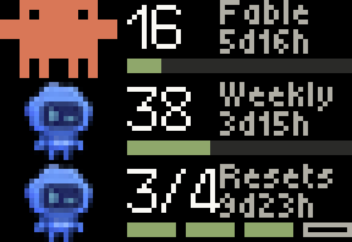

# Petmeter on a BUSY Bar

Coding-agent usage on a [BUSY Bar](https://busy.app) — a 72×16 RGB LED matrix — rotating through every quota your plans meter, each with its label and its mascot.



*Three of the five cards, rotating every four seconds. Captured off the device
itself with [`tools/busybar_shot.py`](../tools/busybar_shot.py).*

This is a self-contained corner of [Petmeter](../README.md). The desk meter it belongs to is an ESP32 device; nothing here needs one. All it needs is the Petmeter daemon running on a host the bar can reach.

## Two ways in

|  | Push | Pull |
|---|---|---|
| **What** | the daemon draws on the bar every poll | an app on the bar fetches and draws |
| **Where** | [`daemon/sinks/busybar.py`](../daemon/sinks/busybar.py) | [`petmeter/`](petmeter) — a TypeScript app built with `busy-cli` |
| **Shows** | one quota | every quota, rotating, with mascots |
| **Needs** | a config line | installing the app and launching it |
| **Works today** | yes | yes — launch it from the apps menu, or the CLI |

They are complementary: push keeps the bar current while you are not looking; pull makes it right the moment you select it.

### Push

```ini
# ~/.config/claude-usage-monitor/config
busybar_url = http://10.0.4.20      # USB; or http://busybar.local over Wi-Fi
```

Restart the daemon. Dry-run without it:

```bash
python -m daemon.sinks.busybar http://10.0.4.20
```

### Pull

```ini
# ~/.config/claude-usage-monitor/config
busybar_serve = 10.0.4.21:8724      # this host, on the bar's USB network
```

```bash
cd busybar/petmeter && pnpm install && pnpm build
python3 ../../tools/busybar_install_app.py http://10.0.4.20
```

Then launch it over the bar's CLI (`telnet 10.0.4.20`, port 23):

```
js -i app.petmeter /ext/user_assets/app.petmeter/scripts/main.js
```

**Controls are written but cannot run yet.** They follow what the case is engraved with — the red **Start/Pause** bar holds and releases the rotation, the wheel **scrolls** by hand, and its press, labelled **OK/Skip**, skips forward — but a CLI-launched script gets no input API. Its globals are exactly `console`, `setInterval`, `setTimeout`, `clearInterval`, `clearTimeout`, `Request`, `fetch` and `localStorage`; `listen` is installed only for an app launched as an app, which is the same thing [the apps menu blocks](#why-it-is-not-in-the-apps-menu). The binding is guarded and logs that it is disabled, so the display keeps working.

## Nothing here is hosted

Both halves run on hardware you own: the daemon on your machine, the app on the
bar, talking over the USB link (`10.0.4.21` ↔ `10.0.4.20`). The pull endpoint
binds to that interface alone, not `0.0.0.0`.

There is one case where a server would help — reading your usage while away
from the machine — and it is the case to avoid. The numbers come from OAuth
tokens that Claude Code and the Codex CLI keep locally, and this project's rule
is that it only ever reads tokens it does not own. Relaying them through a
hosted service would mean shipping someone else's credentials off the laptop.

Distribution is a GitHub Release, not a deploy: `.github/workflows/release.yml`
turns a version tag into the `.tgz` device package, built by `busy-cli`.

## What we learned the hard way

Everything here was found against real hardware, and none of it is in the published API spec.

**The device and the cloud mount the same API at different prefixes.** `api.busy.app` documents `/busybar/...`; that is the cloud relay. The bar serves **`/api/...`**. Posting to the documented path reaches the bar's web-UI file server, which answers `405 Allow: GET` — an error that reads like "wrong method" and means "wrong prefix".

**Access over Wi-Fi is off by default; over USB it is not gated.** Ask the device rather than inferring: `GET /api/access` is ungated and returns `{"mode": "disabled"|"enabled"|"key"}`. Over USB the bar is always **10.0.4.20** (printed on its back cover) and the host is **10.0.4.21**.

**An out-of-memory abort is completely silent.** This one cost the most. The JS runtime's heap is small — 40,000 array pushes kills it — and when it dies, nothing is logged: the script's first line prints, the last never does, no error, no exit message. `@busy-app/busy-lib`'s `render()` ships font metric tables that exceed it, so the app composes its elements by hand with absolute coordinates. A 72×16 screen wants absolute positions anyway.

**Image paths resolve against the app root**, not the assets folder — `appmeta/assets/clawd_16.png`, not `clawd_16.png`. And one unreadable image **rejects the entire draw** with a 400, so a wrong path means no frame at all rather than a frame with a gap in it.

**`rectangle` has no `color`.** It has a `fill` (default `none`) and a border (default 1px, **white**). Pass a colour and nothing else and you get a white outline.

**Storage writes are create-only.** Writing over an existing file returns `508 "Failed to open file for writing"`, which reads like a disk fault and means "this path is taken". Delete first. A running app also holds its script open, so stop it before reinstalling — the installer does both.

**Panel greys vanish.** There is no lit background for them to sit against, so the track colour that reads as "secondary" on an AMOLED reads as "off" here.

**`GET /api/screen` is not the `image/bmp` it advertises.** The front panel returns **base64 text** decoding to 3456 bytes (72×16×3) in **BGR**; the back returns 6400 bytes of 8-bit greyscale at 80×80 for a 160×80 panel, so it is half width. [`tools/busybar_shot.py`](../tools/busybar_shot.py) handles both — QA the layout by looking at it, the way the firmware is QA'd.

**The bar is slow over Wi-Fi and goes quiet.** A draw answers in ~5.0s, consistently, and after a burst of requests it stops answering for ~20s. Over USB the same draw returns in under 0.1s. A timeout set at the measured response time is a coin flip, not a margin.

## Launching it, and the apps menu

**Launch it as a real app**, not as a loose script:

```
loader open js_app_launcher app.petmeter
```

over the device's telnet CLI (port 23). `js -i app.petmeter <path>` also runs
the script, but as a CLI job rather than an app.

**The apps menu is flag-gated, not hardcoded.** `apps_menu_is_js_apps_enabled()`
stats a file; without it the menu shows "More apps soon" and lists nothing,
which reads exactly like a firmware that cannot list user apps. It can, once
asked:

```bash
python3 tools/busybar_install_app.py http://10.0.4.20 --enable-menu
```

That writes `/ext/apps_data/apps_menu/js_apps_enabled`, and the placeholder is
replaced by the real list.

**A manifest key can stop the app loading.** `busy-cli` scaffolds
`heap_size_kib`, which firmware 1.2.4 does not know, and the launcher answers
`App loading failed, reinstall it.` The loader checks only three things —
`appmeta/manifest.json` parses, the directory name equals the manifest `id`,
and `scripts/main.js` exists — so a manifest it cannot parse fails all of it
with one message. Removing that key is the whole fix. Icons
(`appmeta/icon_front_8x8.png`, `icon_back_11x11.png`) are optional to load but
are what the menu shows.

## The buttons cannot work on this firmware

Not a binding bug, and not something an app can code around: `js_input.c` — the
file that installs the `listen` global — was added on **2026-09-16**, five days
*after* release **1.2.4** (2026-09-11), the newest tag and what the device
runs. `raw.githubusercontent.com/.../1.2.4/.../js_input.c` returns 404. That
firmware's `js_runner.c` sets up exactly `console`, the interval functions,
`fetch` and `localStorage` — precisely the globals a `for…in` probe enumerates
on the hardware.

So the app guards `typeof listen === "function"`, rotates without controls
today, and picks the buttons up on a firmware that includes that commit.

**A host-side route exists in the meantime.** The CLI's `input dump` streams
one line per physical event (`key: InputKeyStart type: InputTypePress`), and
the telnet server accepts a shell per connection, so a daemon-side reader could
own the buttons and drive the push sink. Caveat from `canvas.c`: while our
elements are up the canvas swallows Start/Ok/Up/Down, and a short
Back/Busy/Custom/Off/Apps/Settings press closes the canvas.

## Layout

```
 0            23 26                    44 45        71
├─── mascot ────┤├─ 16 (large) ─┤        │ Fable    │  rows 0..4
                │                        │ 5d16h    │  rows 6..10
                ├──── bar: track + fill, 46x3 ──────┤  rows 12..14
```


**The mascots.** Clawd is authored on a 12×8 grid at 100px a cell, so he
renders at exactly 2× — 24×16, filling the height with no resampling. That
matters more than it sounds: averaging him down blends orange into
transparency, and on an unlit matrix that blend reads as *brown*, while his
square eyes smear into diagonal marks. Sample the grid instead and he comes
back exactly as drawn. Codey is 16 wide and sits centred in the same slot;
both stand 16 tall, which is what reads as "the same size".

**No percent sign.** With a 24px mascot there is no room for one beside three
digits, and a small sign set after the number ran straight into the reset line
— `18` and `%5d16h` sharing a row. The label names the quota and the bar shows
the proportion, so the sign was the least load-bearing thing on the card.

**The column is fixed at x=45** rather than following the number's width, or
the label would jump between cards.

Colour thresholds are the firmware's `pct_color()` — green under 75%, amber to
90%, red above — because two displays showing one number must not disagree
about whether it is alarming. The number itself stays white: the firmware
colours bar indicators, never text.

**Reset times are formatted on the app side** (`5d16h`, `1h25m`), *not* with
the device's `countdown` element. That one renders `HH:MM:SS` in a wide font,
ticks every 100 ms, and takes hours modulo 60 — a five-day reset would display
as 21 hours.

**Reset credits are a count, not a proportion**, so that card keeps the desk
device's ledger instead of a bar: one cell per credit the window handed out,
solid while held and hollow once spent.

**Every frame names every element id**, unused ones as tombstones. Draws merge
by id, so anything left unnamed stays on screen — including elements from an
older build of the app, which is why it clears its canvas once at startup.
