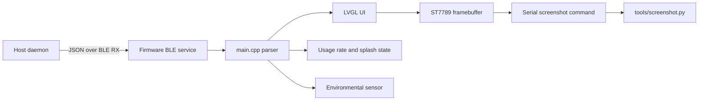

# Clawdmeter Architecture

## Runtime Flow

## Ownership

- `firmware/src/main.cpp`: hardware setup, LVGL flush, serial commands, payload routing, and main loop.
- `firmware/src/ble.cpp`: NimBLE service, characteristics, notifications, and connection state.
- `firmware/src/data.h`: firmware-side payload models.
- `firmware/src/ui.cpp`: screen construction, navigation, and data presentation.
- `firmware/src/splash.cpp`: animation selection and rendering.
- `daemon/claude_usage_daemon.py`: cross-platform host polling and BLE writes.
- `tools/`: source asset conversion and screenshot tooling.

## Constraints

The target is an ESP32-WROOM-32 with no PSRAM and a 135x240 ST7789 display. Keep render buffers, fonts, icons, and generated animation data within the available SRAM and flash budget. PMU, IMU, and touch are unavailable by default.

## Change Workflow

1. Query the workspace graph and read the applicable instructions.
2. Identify the owning module and protected boundary.
3. Make one bounded change.
4. Compile or run the narrowest behavior check.
5. Use serial screenshots for display changes and payload fixtures for protocol changes.
6. Update this document or the protocol document when boundaries change.
