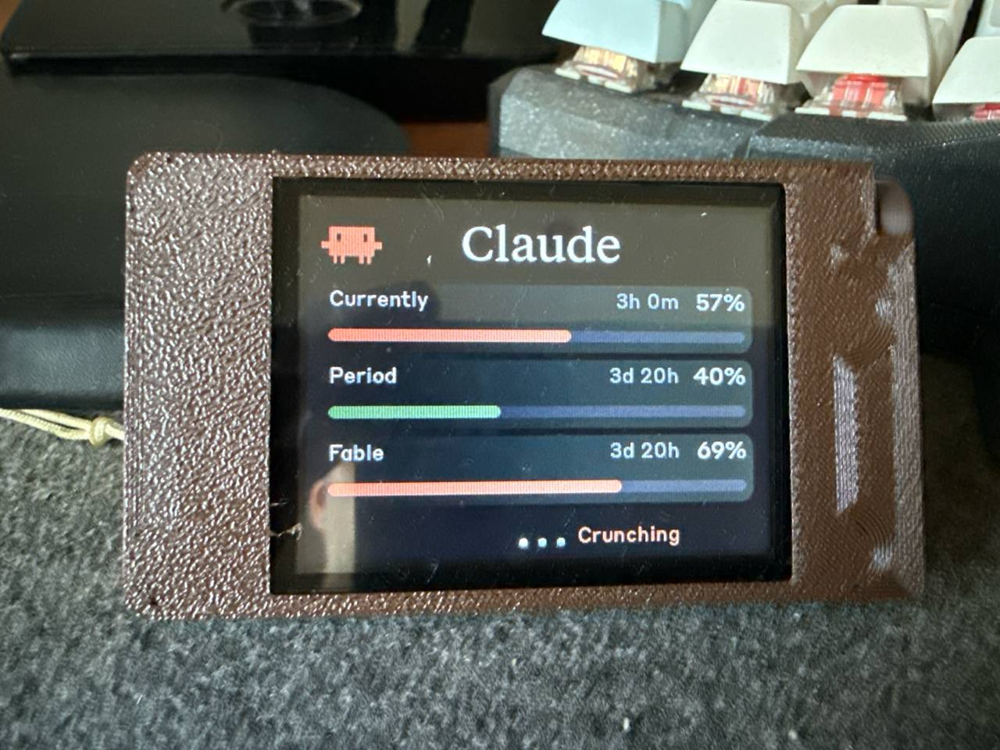
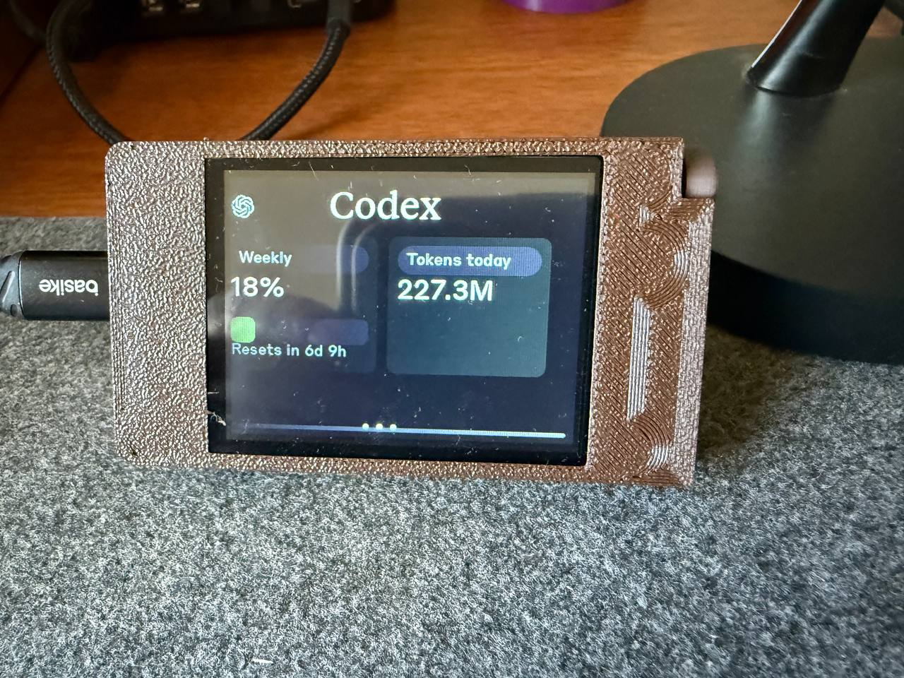
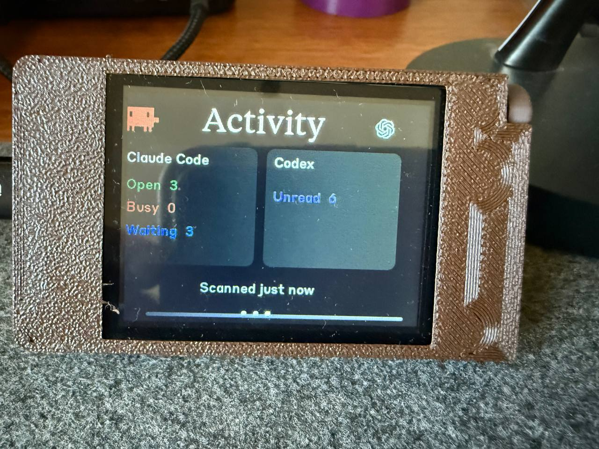
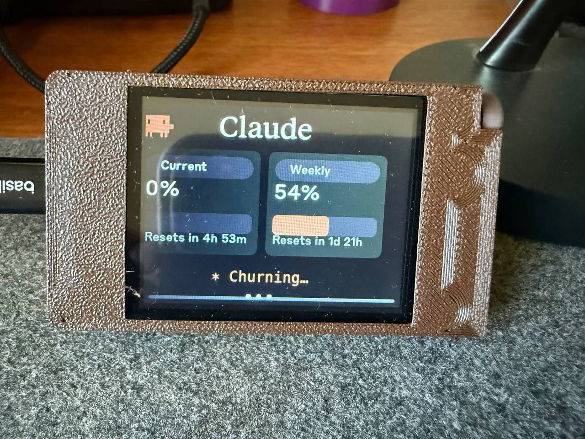
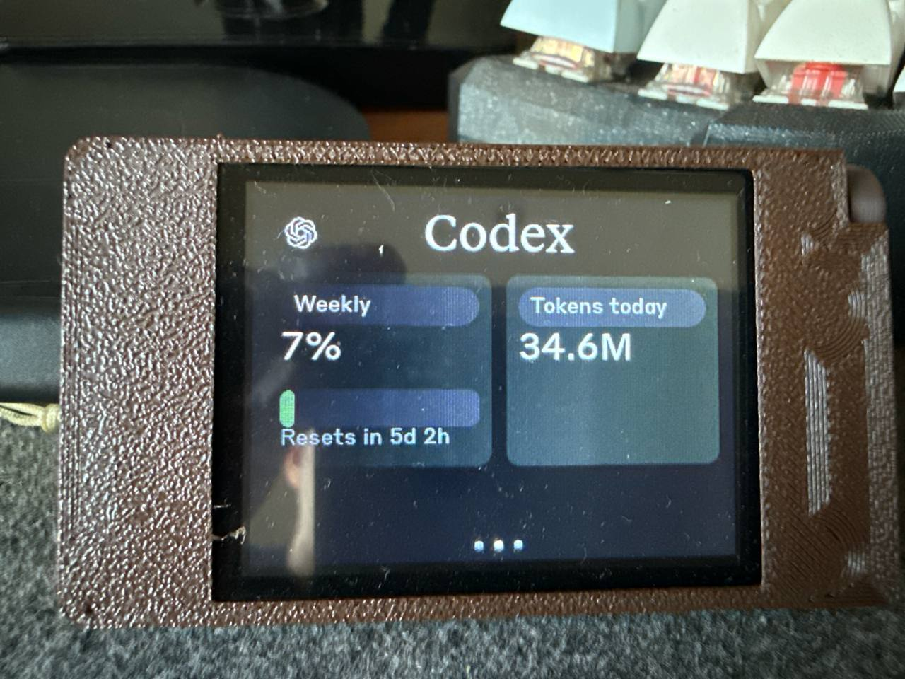

# ESP32-2432S024C hardware gallery

Physical validation of the capacitive 2.4-inch, 240×320 ESP32-2432S024C in
USB-left landscape orientation. The board is mounted in a filament-printed
enclosure and receives power and dashboard data over USB.

## Current dashboard

### Claude and Fable

The compact three-row Claude page displays the current five-hour session,
weekly period, and optional Fable scoped allowance.

### Codex

The Codex page displays the locally observed weekly allowance and tokens used
today.

### Activity

The combined Activity page displays Claude Code Open, Busy, and Waiting counts
alongside the Codex unread count.

## Earlier interface iterations

These photos are retained to document the UI evolution during physical testing.
They are not the current default layout.

| Earlier Claude two-card layout | Alternate Codex capture |
| :---: | :---: |
|  |  |

[Back to the main README](../../../README.md) ·
[Guia em português](../../README.pt-BR.md)
