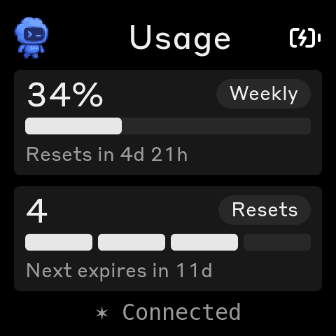
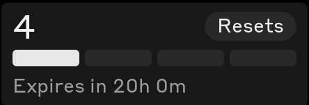

# Petmeter — what this fork adds

Clawdmeter shows one plan's usage. Petmeter shows several, switched on the
device, with each provider getting its own palette, typeface and mascot so a
glance tells you which one you are looking at.

This document covers everything the fork adds on top of
[HermannBjorgvin/Clawdmeter](https://github.com/HermannBjorgvin/Clawdmeter).
For upstream's architecture — the HAL, the board ports, the splash engine —
see the root `CLAUDE.md`.

---

## 1. Provider collection (host side)

### The seam

`daemon/collectors/` defines what the daemon requires of a provider:

```python
class Collector(Protocol):
    provider: str
    async def collect(self) -> UsageSnapshot | None: ...
```

`UsageSnapshot` is the normalized view — `windows` keyed by `"5h"` / `"7d"`,
plus `model_windows` for plans that meter specific models separately. The
daemon consumes it without knowing which vendor produced it.

`collect` is **async** because the daemon loop is asyncio-driven (bleak owns
the BLE connection) and collectors block — HTTP, and rollout logs that run to
hundreds of megabytes. `CodexCollector` offloads via `asyncio.to_thread`
rather than stalling the device link.

### Free-ride credentials

Inherited from upstream and extended to every provider: **a collector never
refreshes an OAuth token.** The CLI that owns the token does all refreshing; a
collector reads whatever is currently stored and reports `None` when it is
dead, which the device renders as "No data". Refreshing races the owning CLI
and can invalidate its session. See `daemon/tests/test_freeride.py`.

### Claude

Unchanged in substance, but the header parsing moved out of the two Python
daemons into `daemon/collectors/claude.py`. They had carried byte-identical
copies that had **drifted**: the Windows one hardened `_billing_period_info`
after a field report (#104) where an out-of-range reset header raised
`OSError(22)` and killed the poll loop, and the macOS copy never got the fix.
The shared version is the hardened one.

### Codex

Two sources, in preference order:

1. `GET https://chatgpt.com/backend-api/wham/usage` with the OAuth token from
   `~/.codex/auth.json`. Live, one request. **Undocumented** — it is what the
   Codex CLI and CodexBar use, and it can change without notice, which is why
   (2) is not optional.

   **It is also slow.** Healthy calls measure 3–4s, and during a degraded spell
   6 of 8 attempts exceeded a 10s timeout. `HTTP_TIMEOUT` is 25s for that
   reason: a short timeout here does not fail fast, it silently promotes the
   fallback.
2. The `rate_limits` object the CLI records into its session rollout JSONL
   under `~/.codex/sessions`. No network, but only as fresh as your last
   Codex session — reported via `UsageSnapshot.stale_seconds`.

   **The fallback rides out a brief outage; it does not stand in for live
   data.** Two guards, both added after it put a wrong number on the device:
   a record whose window has already reset is dropped, since its percentage
   describes an accounting period that no longer exists; and a record older
   than `MAX_LOG_AGE_S` (1 hour) is refused outright.

   The failure it prevents: with the endpoint timing out, a 16-hour-old record
   reported **69%** of a weekly window that had since shifted, while the account
   was at **10%** of a fresh one — and nothing in the wire format marked it
   stale, so it rendered exactly like a live reading. A blank panel is
   recoverable; a confidently wrong one is not.

   The deeper fix is still open: `stale_seconds` never reaches the device, so
   the UI cannot distinguish live from cached at all. Until it does, refusing
   stale data is the only honest option.

**The trap in this data:** account limits and per-model limits sit side by
side. A Codex Pro account meters one account-wide weekly window — no 5-hour
window at all — plus a `GPT-5.3-Codex-Spark` bucket with its own 5h and
weekly. They are unrelated numbers. Reading the newest rollout record blindly
returned **0%** off the Spark bucket while the account sat at **78%**. Both
readers select `limit_id == "codex"` explicitly, and per-model quotas live in
`model_windows`, never merged into `windows`.

Also: `primary` / `secondary` are **positional, not semantic**. A Pro plan
puts its 7-day window in `primary` with `secondary` null; a per-model block
puts 5h there. Always classify by duration.

---

## 1b. Secondary displays (`daemon/sinks/`)

`collectors/` is the input seam; `sinks/` is the output one. The device on the
desk is **not** a sink — it owns the BLE link, the refresh nudge and the poll
clock. A sink is somewhere the payload gets *mirrored* after the device has
been told.

Two rules, and they are the same rule the second provider follows:

- **A sink never gates the device.** Its result does not advance `last_poll`.
  A Busy Bar that has been unplugged must not throttle the meter on your desk,
  and one that answers instantly must not excuse a failed BLE write.
  `test_a_dead_sink_does_not_change_what_the_device_write_reports` guards this.
- **A sink never delays the device.** `publish_soon()` schedules the fan-out
  and returns. Not hypothetical: the Busy Bar answers in ~5s, which awaited
  inline would have put five seconds on every poll of the primary device. An
  update still in flight when the next is ready is skipped, not queued — these
  are current-state displays and a backlog of stale frames helps nobody.
- **A sink never takes the daemon down.** Exceptions never leave `publish()`.
  They are logged, not swallowed: a display that has quietly stopped updating
  is the exact failure this project exists to prevent.

**Where the fan-out lives.** Inside `Session.write_payload()`, not at its three
call sites — the same reasoning as the Codex merge trap below. One chokepoint
cannot be half-wired; three call sites can, and the tests would not notice.

Sinks are opt-in via the config file and cost nothing unconfigured.

### BUSY Bar

> **[`busybar/README.md`](../busybar/README.md) is the reference** for this — setup both ways, the device quirks, and why the app is not in the apps menu. It is self-contained so it can be published on its own.

[busy.app](https://busy.app) — a 72×16 RGB LED matrix with an open HTTP API
over USB or Wi-Fi, no cloud round trip. Enable it with:

```ini
# ~/.config/claude-usage-monitor/config
busybar_url = http://busybar.local
busybar_token =            # only for the cloud endpoint; local needs none
```

One `POST /busybar/display/draw` carries a list of elements, so the usage view
ports across as data rather than pixels — the percentage is a `text`, the bar
is two `rectangle`s, and the reset is a `countdown`.

Four things about the device drove the layout:

- **72×16 is the whole canvas.** One quota fits, not two. It shows the 5-hour
  session window, the one that actually stops you.
- **`countdown` renders on-device.** It takes a Unix timestamp and counts down
  by itself, so "resets in" stays true between polls — no heartbeat needed, in
  contrast to the BLE path where the daemon must replay the payload with aged
  `sr`/`wr` to keep the device's `DATA_FRESH_MS` from lapsing.
- **Text is printable ASCII only** (`^[\x20-\x7E]+$` in the API spec) — the
  same constraint the firmware's subset fonts impose, for the same reason.
- **Priority decides who owns the screen.** Draws are accepted at `>=` the
  running app's priority, and an active BUSY/CUSTOM focus session sits at 90.
  We publish at 50, deliberately below it: the device's job is telling people
  you are busy, and a usage widget must not stomp that. The cost is that the
  meter is absent exactly while you are heads-down. A `409` is therefore a
  normal outcome, not a failure, and is not logged as one.

Colour thresholds are the firmware's `pct_color()` values, because two
displays showing one number must not disagree about whether it is alarming.

**Dry-run without touching the daemon:**

```bash
python -m daemon.sinks.busybar                       # print the draw request
python -m daemon.sinks.busybar http://busybar.local  # and send it
```

**Two traps, both of which cost an hour:**

*The device and the cloud mount the same API at different prefixes.* The
published spec at `api.busy.app` documents `/busybar/...` — that is the **cloud
relay's** namespace. The bar itself serves **`/api/...`**. Posting to the spec's
path reaches the device's web-UI file server instead, which answers
`405 Method Not Allowed` with `Allow: GET`: an error that reads like "wrong
method" and actually means "wrong prefix". The on-device paths are documented
at `http://<bar>/docs` and in [the widget guide](https://blog.busy.app/how-to-make-a-busy-bar-widget-without-coding/).

*Access over Wi-Fi is off by default.* On the right prefix an ungated request
returns `403`. Do not infer why — `GET /api/access` is itself ungated and
answers `{"mode": "disabled" | "enabled" | "key", "key_valid": bool}`. Turn it
on in the BUSY Bar settings; `key` mode takes a 4–10 digit key, which goes in
`busybar_token`. Over USB the bar is always **10.0.4.20** and the Wi-Fi gate
does not apply.

**A rectangle has no `color`.** It has a `fill` (default `none`) and a border
(default 1px, white). Pass a colour and nothing else and the device draws a
white outline — which is what the first version put on the hardware, two white
rules where the bar should have been. Every rectangle needs
`fill: "solid"`, `fill_colors: [...]` and `border_width: 0`.

**Panel greys are invisible on an LED matrix.** There is no lit background for
them to sit against, so the track colour that reads as "secondary" on the
AMOLED read as "off" on the bar and the countdown simply was not there. The
countdown uses the firmware's `dim` (`0xB0AEA5`) instead.

#### An on-device app, and why it is not in the menu yet

The bar can also *pull* instead of being pushed to, as an app you pick from its
apps menu. Everything that needs is already on the device, undocumented:
`apps_assets/js_runner` is a JavaScript runtime, and `user_assets/` holds apps
as plain directories — the firmware ships `app.busy.js_example` as a working
template:

```
/ext/user_assets/app.petmeter/
  appmeta/manifest.json       {format_version, id, name, version, ...}
  appmeta/icon_front_8x8.png
  appmeta/icon_back_11x11.png
  scripts/main.js
```

The runtime's own `fetch.js` example fetches `https://qdiv.dev`, so app code
can reach the network, not just the bar's API. That makes a pull design work:
`busybar/app.petmeter/scripts/main.js` fetches the daemon and draws, and
`daemon/sinks/serve.py` answers `GET /usage.json` with the latest payload.
Over USB both addresses are fixed — the bar is **10.0.4.20** and the host
**10.0.4.21** — so there is nothing to discover and no Wi-Fi involved. Enable
it with `busybar_serve = 10.0.4.21:8724` and install with
`tools/busybar_install_app.py`.

**It installs, and it will not appear.** On this firmware the apps menu is a
placeholder reading *"More apps soon — keep your device up to date for
upcoming apps"*, and nothing in `user_assets/` is listed, including the
vendor's own example. The JS SDK is documented as "coming soon"; this is what
that looks like from the device side. The app is inert until the menu opens
up — `tools/busybar_install_app.py --remove` takes it off.

Push (`daemon/sinks/busybar.py`) is therefore the path that works today, and
the two are complementary rather than alternatives: push keeps the bar current
while you are not looking, pull makes it right the moment you select it.

**QA it the way the firmware is QA'd** — don't design a 72×16 layout blind:

```bash
python3 tools/busybar_shot.py out.png http://10.0.4.20
```

`GET /api/screen` is documented as `image/bmp` and is neither: it returns
**base64 text** which decodes to 3456 bytes (72×16×3), and those bytes are
**BGR**. Sending `#8FA76B` (143,167,107) and reading back (107,167,143) is what
proves it — render without the swap and amber looks blue.

**The bar is slow over Wi-Fi, and goes quiet.** A draw answers in ~5.0s over Wi-Fi,
consistently, and after a burst of requests it stops answering for ~20s. **Over
USB the same draw returns in under 0.1s** — if you are iterating on a layout,
use USB. The
first live attempt failed on a 5s `ConnectTimeout` against a device that was
about to answer — the same trap as the Codex endpoint, where a timeout set at
the measured response time is a coin flip rather than a margin. `HTTP_TIMEOUT`
is 20s, which it can afford because the fan-out does not block the poll loop.

## 2. Wire format

Claude stays at the top level so an older firmware ignores everything new.

| Field | Meaning |
|-------|---------|
| `x` | A second provider's usage, same field names nested one level down |
| `has_s` / `has_w` | Whether that panel has a real quota behind it. A Codex Pro account has no 5-hour window; a slot with nothing behind it renders `-` with an empty bar and no reset line, because a zeroed panel is a lie about a limit that does not exist |
| `sm` / `wm` | Pill overrides — `"Spark"`, `"Overall"` — for a panel showing one model's slice rather than the account's |
| `ws` | Weekly scoped-model limits, `[{"n":"Fable","p":75}, ...]`, which the Weekly card flips between (from the merged fable branch) |

The daemon sends **every** provider it can read in one payload rather than the
device requesting one. The device holds a slot per provider and picks by mode,
so switching is instant instead of waiting for the next poll.

**A dead provider does not hide a live one.** The no-data beat (`{"ok": false}`,
sent when no Claude token authenticates) carries `x` too. The device reads
Claude's fields from the top level, so Claude mode still shows "No data" while
Codex mode stays live — an expired Claude token says nothing about Codex.

**Where the merge goes.** It belongs in `poll_active()`, not
`poll_active_payload()`. The latter reads like the entry point and is not one
— `run()` calls `poll_active()` directly because it needs the all-dead flag.
Every unit test passed while the device never received an `x` key; only the
live daemon log caught it. `test_poll_active_itself_merges_codex` guards this.

### Reset credits

A reset credit is a one-shot rate-limit reversal: redeeming one clears a spent
Codex limit instead of waiting out the window. OpenAI grants them unprompted
and **they expire 30 days after they are granted**, so the device's job is less
"how many do you have" than "how long have you got" — see
[the README](../README.md#reset-credits-codex) for the user-facing framing.

`wham/usage` reports how many reset credits are available but nothing about
them. Two more endpoints fill the card in:

| Endpoint | Carries |
|----------|---------|
| `GET .../wham/rate-limit-reset-credits` | `granted_at` / `expires_at` / `status` per credit |
| `GET .../wham/rate-limit-reset-credits/history` | `granted` and `used` events inside a server-defined trailing window (`window_start`..`as_of`, 30 days today), plus a `next_cursor` |

Together they give the ledger the device draws: what you still hold, plus what
you spent inside the window. **Held plus spent is the only arithmetic that
reconciles.** A credit used inside the window was often granted *before* it —
on the account this was built against, the window held three `granted` events
and one `used` whose grant predated it — so counting `granted` events would
report three while four resets actually passed through your hands.

The window length is the provider's, not ours: it comes back as
`as_of - window_start` and is never hardcoded.

Both endpoints are slow and neither moves on its own, so the pair is cached for
an hour — but **the live `available_count` from `wham/usage` busts that cache
early whenever it changes.** Spending a credit moves it from one side of the
ledger to the other; letting the held side drop while the spent side waited out
the hour would show a cell vanishing instead of going hollow, and the card
would briefly disagree with itself. `test_spending_a_credit_busts_the_cache_early`
guards this.

**The cache holds raw stamps, never anything derived from them**, so the
countdown to the next expiry recomputes against the clock on every poll rather
than freezing for an hour at a time.

They reach the device as `rc` (held), `ru` (spent inside the window) and `rm`
(minutes until the soonest expiry — a duration like `sr`/`wr`, because the
firmware has no date handling and formats every countdown with the same
`"in 4d 21h"` line). All three absent means the provider has no such thing and
the card is never drawn; `rc: 0` with a non-zero `ru` is a real state — a
window whose resets were all spent — and still draws.

### Codex panel mapping

A Codex Pro account has no account 5-hour window, so the top panel cannot
mirror Claude's "Current". Both panels are weekly:

- **top** — the model's weekly quota, pill `"Spark"`
- **bottom** — the account weekly quota, pill `"Overall"`

Both must be shown. Spark can sit at 0% while the account weekly is nearly
spent, and it is the account limit that actually stops you. An earlier
version sourced both panels from Spark for consistency and produced an
accurate, useless screen: `0% / 0%` at the moment the binding limit was at
84%.

**Since September 2026 this is moot on Pro:** OpenAI dropped
`additional_rate_limits` entirely, so the account reports one weekly window and
nothing else. A lone quota takes the top slot labelled `"Weekly"`, and the
second card carries reset credits instead — count where the percentage goes,
`"Resets"` in the pill, expiry underneath. With neither a second quota nor
credits, the card is hidden outright: a card whose only content is a dash
reads as a fault, not as "this plan has no such limit".



**The credit card (`render_credit_card`).** One cell per credit the window
handed out, in the row the bar would occupy, filled while the credit is held
and hollow once spent, held ones first so the lit run's length reads as "what
I can still spend". The number above is the total, so the card answers both
questions a use-it-or-lose-it grant raises — how many did I get, how many are
left — in a single read. Cells are capped at `MAX_CREDIT_CELLS`; past that the
number still tells the truth, and a window handing out that many is not one
you are rationing.



**Cells are binary on purpose.** The first version of this row filled each cell
by how much of that credit's lifetime remained, which made every cell a
percentage nobody thinks in, stated the count twice (as a number and as a row
length), and — worst — drained toward red while the quota bar directly above it
filled toward red, so one shape carried opposite meanings on two stacked cards.
The second version dropped to a single bar in the quota card's own grammar,
which read cleanly but could only describe the head of the queue. The ledger
keeps that grammar for the countdown line and gives the row back its discrete
job.

The line underneath reads `Next expires in 11d` (or `Expires in 2d` when one is
held; hours and minutes inside the last day, from the shared
`format_countdown()`), and `All used` when the row is entirely hollow — a blank
line there reads as a value that failed to load. Whole days above a day: a
30-day grant is spent on a scale of days, and `11d 3h` is both noise and too
wide for the 368 px boards.

`render_weekly_face()` owns those labels and runs after that branch, so it
stands down when the card is showing credits.

---

## 3. Themes

`firmware/src/theme.h` is a table of `Theme` structs behind a `theme()`
accessor. ui.cpp already routed everything through `COL_*` macros, so **no
call site changed**.

Colors are stored as plain hex, not `lv_color_t`: `lv_color_hex()` is a
function, so a table of calls would run at static-init time, before LVGL is
up. Call sites convert at point of use.

| Field | Claude | Codex |
|-------|--------|-------|
| palette | warm greys, terra-cotta accent | neutral greys, ChatGPT green |
| `sans_only` | false — serif display face | true |
| `progress` | green | off-white — usage is information, not good news |
| `quiet_status` | false | true — no rotating gerunds |
| `scoped` | `0x4a7dea` | same — marks a model's slice, not a brand |

**Fonts.** Only three slots are serif (`title_font`, `ent_pct_font`,
`bt_title_font`), so the family swap runs as a post-pass after
`compute_layout()` picks sizes. `sans_for()` maps Tiempos 56 → Styrene 48 and
34 → 28, one nominal step down, because a grotesque's larger x-height reads as
the same optical size.

OpenAI Sans is **not** used: proprietary and undistributed. Styrene B stands
in, which is Anthropic's own face — a placeholder, not a finished answer.

**Status line.** Codex mode drops Claude Code's spinner glyphs and rotating
gerunds ("Elucidating…") — that is Anthropic's product voice on the wrong
provider. The glyph still animates, because a frozen indicator on a desk
display reads as a hung device; what is dropped is the trailing `…` claiming
work is in progress.

**Thresholds** are 75% warning / 90% critical, applied to both modes. The
previous 50% fired halfway through a session, which trains you to ignore it.

---

## 4. Art sets

Everything that differs between mascots travels in one `ArtSet` record in
`splash.cpp`:

| Field | Why it cannot be global |
|-------|-------------------------|
| `anims` / `count` | different tables |
| `stage_w/h` | Clawd's crops are authored on 55×37, Codey's on 29×34 |
| `groups` | rate-driven picks, matched by name — Codey has none of Clawd's names |
| `acts` | corner-mascot acts; Codey shares only `"waving"` with Clawd's list |
| `walk` | gait-step schedule (below) |
| `peek` | the pose shown large at the far edge mid-trip |

### Gait

`WALK_CRAB` and `WALK_FRONT` are **foot-locked schedules measured from
Clawd's own frames** — which frame plants a foot, how far the body moves.
Applied to another character they lock travel to feet that are not there.
Codey uses `WALK_EVEN`: one cell per gait frame.

### The trip

Walk off stage left, then back in from the right and across the whole width to
the corner slot. The return leg is what crosses the screen.

Clawd additionally appears large at the far edge partway through — his
`lurking` is a pose **drawn already cropped**, a head and shoulder leaning in
from off-stage, so placing it flush to the screen edge reads as peeking round
a corner.

**Codey has no such pose, and faking one does not work.** A borrowed full-body
pose placed the same way reads as the character teleporting: it is a whole
figure standing somewhere it did not walk to. Three attempts — matching the
on-screen height, cropping 45% off the edge, raising it up the panel — each
reduced the problem without fixing it, because the problem is that the
character is *whole*. A set with no drawn peek pose sets `peek = nullptr` and
simply crosses.

If you want the peek for another mascot, draw or crop the pose for it. Do not
borrow a standing one.

### Act selection

Random, not round-robin, never repeating the previous act — with only three or
four acts per band a fixed order is visible within a minute.

The picker is a small xorshift rather than `rand()`, because the Arduino and
native builds disagree about seeding. It reads the **high** bits: xorshift32's
low bits are much weaker, and a modulo by a small power of two takes exactly
those, which cycled between two acts.

### Buffers

`mas_buf` and the peek buffer are allocated **once** at create time, and the
mode can change at any point afterwards — so both are sized from the largest
frame across **every** set, not the active one. Sizing to the active set
overflowed `mas_buf` on the first mode switch.

### Rate gating

Animations are surfaced by usage rate, four bands of four. Clawd's seventeen
tolerate a three-per-band spread; Codey's nine did not — at a low rate only
`idle / happy / waving` ever played and the laptop pose sat in a band you
rarely idle in. Every band now carries four, with distinctive poses in more
than one.

---

## 5. Pet sprite pipeline

`tools/convert_pet_spritesheet.py` reads the sheet format the ChatGPT pets
docs specify for custom pets — transparent PNG/WebP at 1536×1872, an 8×9 grid
of 192×208 frames — and emits `pet_animations.h` in the same
`splash_anim_def_t` layout the Clawd art uses.

```bash
python3 tools/convert_pet_spritesheet.py research/codex-pets/codey-spritesheet.webp --stage-h 34
```

Written in Python, unlike the other `tools/`: Pillow is already a project
dependency (`daemon/icon_assets.py`) and reads WebP natively, whereas the Node
path needs `pngjs`, which is not vendored, plus a `sips` pre-step.

**Four things that only showed up once art was on a screen:**

1. **Palette index 0 is the background slot.** The engine renders code 0
   transparent and indexes `palette[code]` directly, so cell codes start at 1
   and colors must shift up one. Emitting from index 0 rendered every frame
   one color off, with the most common color becoming the background — a blue
   screen with a navy character.
2. **Do not pick the palette by frequency.** Two failures, one after the
   other. Counting in RGB888 collapses the top 15 onto 3 distinct RGB565
   values, wasting twelve slots. Counting the 565-rounded values fixes that
   but still ranks by how *often* a color appears, which loses colors that are
   rare and essential: BSOD is mostly white body and blue screen in many
   near-identical shades, so its top 15 were seven off-whites, five blues and
   the cheek red, with **no dark entry at all**. Its dark outline then matched
   to the red — red has two low channels and beats light grey on distance — so
   every outline came out scarlet. Median cut over the 565-rounded pixels
   allocates by distribution rather than count, so a small far-away cluster
   like an outline keeps its slot.
3. **`loop_end` is the last valid index**, not `frame_count`. One past the end
   means the gait never wraps — the walk plays once and stops, about 12px of
   travel.
4. **Not pixel art.** The Clawd converter recovers cells by sampling centers
   after fitting the grid phase. These sprites are anti-aliased; a run-length
   scan over the opaque pixels returns gcd 1. Cells are area-downsampled and
   then quantized, with a coverage floor so the outline does not smear into a
   halo one ring wider than the character.

Every frame is cropped against **one global content bounding box**, not
per-frame boxes — otherwise the character hops when switching animations.

### Multiple pets

All eight sheets in the pack convert in one pass into a single
`pet_animations.h` carrying a `PETS[]` table, and the Codex art set is
assembled from the selected entry at runtime rather than duplicated eight
times — the groups, acts, gait and lack of a peek pose are properties of "a
ChatGPT pet", not of any one of them. Only the table, stage and name differ.

```bash
python3 tools/convert_pet_spritesheet.py research/codex-pets/*-spritesheet.webp --stage-h 34
```

Converted from `original/`, not the pack's `pixel-perfect-480/`: those are
exact 2× nearest-neighbour upscales with padding, so they carry no extra
information and the converter downsamples anyway.

Cost on the 2.16: flash 65.9% → 74.7% for seven extra pets.

**Dark pets get a luminance lift** (`--min-peak`, default 150). The sprites are
drawn for the pets page, on white. On a true-black AMOLED the premise inverts:
Null Signal's *entire* palette peaks at luminance 48 of 255 and Stacky's at
101, against a background of 0, so both are all but invisible. The six others
peak between 139 and 255 and are untouched.

The lift is one multiplier across all channels, so hue and relative shading
survive and the pet stays the darkest of the set. Null Signal takes ×3.09,
Stacky ×1.46.

This **deliberately departs from the source artwork** — Null Signal is drawn to
be a barely-there shadow, which reads correctly on a white page. It is a
display adaptation, not a correction. Do not "fix" it back.

Swapping a sheet for a commissioned one at the same dimensions is a drop-in
change; the converter reads the grid, not the character. See
[`research/codex-pets/CLAUDE.md`](../research/codex-pets/CLAUDE.md) for
provenance and the licensing position.

---

## 6. Controls

**Left button (PRIMARY).** Tap switches the pet — Codex mode only, since the
Claude side has one mascot and a tap there is a deliberate no-op. Hold freezes
every mascot: the splash animation, the corner acts and the trips all hold
their current frame, with a `Pets held` / `Pets live` hint. Persisted, since
the point of quieting a desk display is that it stays quiet.

**Right button (SECONDARY).** Tap flips the provider now; hold cycles the
auto-flip cadence `30s → 1m → 2m → 3m → off`, stepping again while held so one
hold reaches any cadence. The hold fires on the threshold, not on release, so
the gesture confirms itself under your thumb, and flashes its new label on the
status line — enabling auto-flip has no other visible effect for minutes.

Between them these **retire both HID bindings** — Space (voice-mode
push-to-talk) and Shift+Tab. No supported board has a third button, and the
buttons are worth more driving the screen in front of you than sending
shortcuts to a terminal.

`MODE_HOLD_MS` 600, `SECONDARY_DEBOUNCE_MS` 30, `MIN_FLIP_GAP_MS` 250. The
last is a guard, not a root-cause fix: two flips once landed in the same
millisecond with the timer measurably correct, so a repeat within 250ms is now
ignored at the one place every flip goes through.

**Only the 2.16 has a second button** (`button_count == 2`). On the 1.8, 2.06
and C6 boards the toggle is unreachable by button; use auto-flip or serial.

Mode and cadence both persist to NVS in the `"clawdmeter"` namespace.
`theme_init()` must run **before** `ui_init()` and `splash_init()` — the mode
picks the palette, the font family via `compute_layout()`, and the art set,
all read while those build their widgets.

---

## 7. QA

Beyond upstream's `screenshot` and `buzz`:

```bash
printf 'usage\n'  > /dev/cu.usbmodem101   # switch to the usage screen
printf 'splash\n' > /dev/cu.usbmodem101   # back to the splash
printf 'mode\n'   > /dev/cu.usbmodem101   # cycle provider
printf 'auto\n'   > /dev/cu.usbmodem101   # cycle auto-flip cadence
```

Then `./screenshot.sh out.png`. This exists because the corner mascot only
lives on the usage screen, a fresh flash boots to the splash, and **no button
leaves it** — PWR cycles animations there and only a touch toggles. Every
check used to be a request to the person holding the device.

The simulator has no serial console, so there the old workaround still
applies: temporarily change the default boot screen, iterate, revert.

**Things the simulator cannot catch**, learned the hard way:

- A payload fed by hand hides a daemon that never sends it.
- A glyph missing from a subset font renders as tofu only on the panel.
- **Stale pixels.** The boards render in PARTIAL mode, so anything not
  explicitly invalidated is simply never repainted. The simulator redraws the
  whole frame every time and shows nothing. A moving sprite must invalidate
  where it *is* before it moves, not only where it lands — otherwise it drags
  a trail of its own leftovers across the screen.

---

## 8. Fonts are subset to ASCII

The Styrene faces carry **U+0020..U+007E only**. The mono face adds exactly
seven non-ASCII glyphs: five spinner asterisks, an ellipsis, and U+00B7.

Anything typographic — em dash, bullet, `●` — renders as tofu. Check the cmap
before reaching for a character. The "no quota" placeholder is a plain ASCII
hyphen and the steady status dot is U+00B7 for exactly this reason.

### Tabular figures

`tools/tabular_digits.py` equalizes digit advance widths in the generated
font tables, so changing numbers stop jittering. Styrene 48 had `1` at 342
units against `0` at 531 — a 55% difference, which moved the percent sign and
everything after it by ~23px as usage ticked.

Regenerating with OpenType `tnum` does **not** solve this: `lv_font_conv`
converts glyphs by codepoint and does not apply OpenType features, and
tabular figures are a feature rather than separate codepoints. The tool widens
every digit to the widest and shifts its bitmap right by half the difference,
so shapes are untouched and only the spacing changes. It is idempotent.

Re-run it after regenerating any font that renders a changing number.

---

## 9. Not done

- **Typeface identity.** Codex mode renders in Styrene B, which is
  Anthropic's own sans. OpenAI Sans is proprietary and undistributed; an OFL
  stand-in such as Inter would need `lv_font_conv` plus the LVGL 9 patching in
  [`docs/fonts.md`](fonts.md).
- **Licensing.** Upstream is deliberately unlicensed because it bundles
  proprietary fonts and mascot art; this fork adds a second vendor to that
  rather than resolving it. See the root README's warning.
- **The bash daemon** (Linux) has no Codex support. Both Python daemons do.
- **One-button boards** cannot reach the provider toggle by button.
